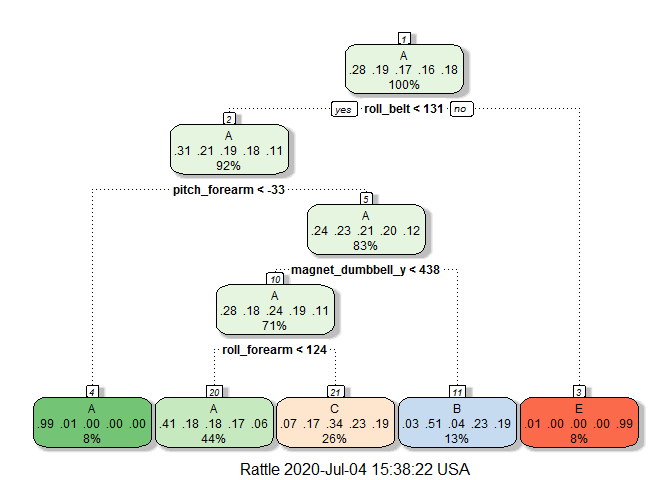

# Topic: Practical Machine Learning Final Assignment
# Author: Muhammad Shahzaib Siddiqui

## Description
Using devices such as Jawbone Up, Nike FuelBand, and Fitbit it is now possible to collect a large amount of data about personal activity relatively inexpensively. These type of devices are part of the quantified self movement – a group of enthusiasts who take measurements about themselves regularly to improve their health, to find patterns in their behavior, or because they are tech geeks. One thing that people regularly do is quantify how much of a particular activity they do, but they rarely quantify how well they do it. In this project, your goal will be to use data from accelerometers on the belt, forearm, arm, and dumbell of 6 participants. They were asked to perform barbell lifts correctly and incorrectly in 5 different ways. More information is available from the website here: http://web.archive.org/web/20161224072740/http:/groupware.les.inf.puc-rio.br/har (see the section on the Weight Lifting Exercise Dataset).

## Source of Data
http://groupware.les.inf.puc-rio.br/har

Training Data:
https://d396qusza40orc.cloudfront.net/predmachlearn/pml-training.csv

Testing Data:
https://d396qusza40orc.cloudfront.net/predmachlearn/pml-testing.csv

## Loading useful libraries


```r
library(rpart)
library(caret)
library(gbm)
library(e1071)
library(randomForest)
library(rattle)
library(rpart.plot)
```


## Reading Data


```r
training <- read.csv("https://d396qusza40orc.cloudfront.net/predmachlearn/pml-training.csv")
testing <- read.csv("https://d396qusza40orc.cloudfront.net/predmachlearn/pml-testing.csv")
```

## Exploratory Analysis


```r
colnames(training)
```

```
##   [1] "X"                        "user_name"               
##   [3] "raw_timestamp_part_1"     "raw_timestamp_part_2"    
##   [5] "cvtd_timestamp"           "new_window"              
##   [7] "num_window"               "roll_belt"               
##   [9] "pitch_belt"               "yaw_belt"                
##  [11] "total_accel_belt"         "kurtosis_roll_belt"      
##  [13] "kurtosis_picth_belt"      "kurtosis_yaw_belt"       
##  [15] "skewness_roll_belt"       "skewness_roll_belt.1"    
##  [17] "skewness_yaw_belt"        "max_roll_belt"           
##  [19] "max_picth_belt"           "max_yaw_belt"            
##  [21] "min_roll_belt"            "min_pitch_belt"          
##  [23] "min_yaw_belt"             "amplitude_roll_belt"     
##  [25] "amplitude_pitch_belt"     "amplitude_yaw_belt"      
##  [27] "var_total_accel_belt"     "avg_roll_belt"           
##  [29] "stddev_roll_belt"         "var_roll_belt"           
##  [31] "avg_pitch_belt"           "stddev_pitch_belt"       
##  [33] "var_pitch_belt"           "avg_yaw_belt"            
##  [35] "stddev_yaw_belt"          "var_yaw_belt"            
##  [37] "gyros_belt_x"             "gyros_belt_y"            
##  [39] "gyros_belt_z"             "accel_belt_x"            
##  [41] "accel_belt_y"             "accel_belt_z"            
##  [43] "magnet_belt_x"            "magnet_belt_y"           
##  [45] "magnet_belt_z"            "roll_arm"                
##  [47] "pitch_arm"                "yaw_arm"                 
##  [49] "total_accel_arm"          "var_accel_arm"           
##  [51] "avg_roll_arm"             "stddev_roll_arm"         
##  [53] "var_roll_arm"             "avg_pitch_arm"           
##  [55] "stddev_pitch_arm"         "var_pitch_arm"           
##  [57] "avg_yaw_arm"              "stddev_yaw_arm"          
##  [59] "var_yaw_arm"              "gyros_arm_x"             
##  [61] "gyros_arm_y"              "gyros_arm_z"             
##  [63] "accel_arm_x"              "accel_arm_y"             
##  [65] "accel_arm_z"              "magnet_arm_x"            
##  [67] "magnet_arm_y"             "magnet_arm_z"            
##  [69] "kurtosis_roll_arm"        "kurtosis_picth_arm"      
##  [71] "kurtosis_yaw_arm"         "skewness_roll_arm"       
##  [73] "skewness_pitch_arm"       "skewness_yaw_arm"        
##  [75] "max_roll_arm"             "max_picth_arm"           
##  [77] "max_yaw_arm"              "min_roll_arm"            
##  [79] "min_pitch_arm"            "min_yaw_arm"             
##  [81] "amplitude_roll_arm"       "amplitude_pitch_arm"     
##  [83] "amplitude_yaw_arm"        "roll_dumbbell"           
##  [85] "pitch_dumbbell"           "yaw_dumbbell"            
##  [87] "kurtosis_roll_dumbbell"   "kurtosis_picth_dumbbell" 
##  [89] "kurtosis_yaw_dumbbell"    "skewness_roll_dumbbell"  
##  [91] "skewness_pitch_dumbbell"  "skewness_yaw_dumbbell"   
##  [93] "max_roll_dumbbell"        "max_picth_dumbbell"      
##  [95] "max_yaw_dumbbell"         "min_roll_dumbbell"       
##  [97] "min_pitch_dumbbell"       "min_yaw_dumbbell"        
##  [99] "amplitude_roll_dumbbell"  "amplitude_pitch_dumbbell"
## [101] "amplitude_yaw_dumbbell"   "total_accel_dumbbell"    
## [103] "var_accel_dumbbell"       "avg_roll_dumbbell"       
## [105] "stddev_roll_dumbbell"     "var_roll_dumbbell"       
## [107] "avg_pitch_dumbbell"       "stddev_pitch_dumbbell"   
## [109] "var_pitch_dumbbell"       "avg_yaw_dumbbell"        
## [111] "stddev_yaw_dumbbell"      "var_yaw_dumbbell"        
## [113] "gyros_dumbbell_x"         "gyros_dumbbell_y"        
## [115] "gyros_dumbbell_z"         "accel_dumbbell_x"        
## [117] "accel_dumbbell_y"         "accel_dumbbell_z"        
## [119] "magnet_dumbbell_x"        "magnet_dumbbell_y"       
## [121] "magnet_dumbbell_z"        "roll_forearm"            
## [123] "pitch_forearm"            "yaw_forearm"             
## [125] "kurtosis_roll_forearm"    "kurtosis_picth_forearm"  
## [127] "kurtosis_yaw_forearm"     "skewness_roll_forearm"   
## [129] "skewness_pitch_forearm"   "skewness_yaw_forearm"    
## [131] "max_roll_forearm"         "max_picth_forearm"       
## [133] "max_yaw_forearm"          "min_roll_forearm"        
## [135] "min_pitch_forearm"        "min_yaw_forearm"         
## [137] "amplitude_roll_forearm"   "amplitude_pitch_forearm" 
## [139] "amplitude_yaw_forearm"    "total_accel_forearm"     
## [141] "var_accel_forearm"        "avg_roll_forearm"        
## [143] "stddev_roll_forearm"      "var_roll_forearm"        
## [145] "avg_pitch_forearm"        "stddev_pitch_forearm"    
## [147] "var_pitch_forearm"        "avg_yaw_forearm"         
## [149] "stddev_yaw_forearm"       "var_yaw_forearm"         
## [151] "gyros_forearm_x"          "gyros_forearm_y"         
## [153] "gyros_forearm_z"          "accel_forearm_x"         
## [155] "accel_forearm_y"          "accel_forearm_z"         
## [157] "magnet_forearm_x"         "magnet_forearm_y"        
## [159] "magnet_forearm_z"         "classe"
```


```r
ncol(training)
```

```
## [1] 160
```

As we can observe that there are few initial columns in dataset which are totally useless to the algorithms so we will drop them.
And there are many columns in the dataset which might not be all useful. 
We will investigate the usefulness of columns further.

We are removing the columns with NA values.
We are also removing the initial 7 columns as they are identifiers and would have no contribution in algorithms. 


```r
training<-training[ , colSums(is.na(training)) == 0]
training<-training[,-c(1:7)]
```
In the machine learning algorithms, the columns with zero or near zero variance are not useful, se we will drop them as well. 
Let`s investigate such columns.  


```r
zerovar<-nearZeroVar(training,saveMetrics=TRUE)
```

Let`s remove such columns.


```r
train_data<-training[,zerovar$nzv==FALSE]
```

Now let`s see how many columns are available.


```r
ncol(train_data)
```

```
## [1] 53
```

So now we are left with few columns which would be useful in classification algorithms. 

## Model Fitting

We have decidede to fit following models on our dataset.

* Recursive Partitioning And Regression Trees
* Random Forest
* Linear Discriminant Analysis
* Gradient Boosting Machine

The model with the best accuracy will be chosen.

Let`s partition the training data set so we can validate our models.
Furthermore, we will make the classe variable as factors. 


```r
inTrain<-createDataPartition(train_data$classe,p=0.70,list=FALSE)
train_set<-train_data[inTrain,]
test_set<-train_data[-inTrain,]
```


### Rpart Model


```r
treemod<-train(classe~.,train_set,method="rpart")
fancyRpartPlot(treemod$finalModel)
```

<!-- -->

### Random Forest Model


```r
rfmod <- train(classe ~ ., data = train_set, method = "rf", ntree = 50)
print(rfmod)
```

```
## Random Forest 
## 
## 13737 samples
##    52 predictor
##     5 classes: 'A', 'B', 'C', 'D', 'E' 
## 
## No pre-processing
## Resampling: Bootstrapped (25 reps) 
## Summary of sample sizes: 13737, 13737, 13737, 13737, 13737, 13737, ... 
## Resampling results across tuning parameters:
## 
##   mtry  Accuracy   Kappa    
##    2    0.9856176  0.9818086
##   27    0.9867760  0.9832739
##   52    0.9759021  0.9695194
## 
## Accuracy was used to select the optimal model using the largest value.
## The final value used for the model was mtry = 27.
```


### LDA Model


```r
ldamod <- train(classe ~ ., data = train_set, method = "lda")
print(ldamod)
```

```
## Linear Discriminant Analysis 
## 
## 13737 samples
##    52 predictor
##     5 classes: 'A', 'B', 'C', 'D', 'E' 
## 
## No pre-processing
## Resampling: Bootstrapped (25 reps) 
## Summary of sample sizes: 13737, 13737, 13737, 13737, 13737, 13737, ... 
## Resampling results:
## 
##   Accuracy   Kappa    
##   0.7025026  0.6233753
```

### GBM Model


```r
gbmmod <- train(classe ~ ., data=train_set, method = "gbm", verbose=FALSE)
print(gbmmod)
```

```
## Stochastic Gradient Boosting 
## 
## 13737 samples
##    52 predictor
##     5 classes: 'A', 'B', 'C', 'D', 'E' 
## 
## No pre-processing
## Resampling: Bootstrapped (25 reps) 
## Summary of sample sizes: 13737, 13737, 13737, 13737, 13737, 13737, ... 
## Resampling results across tuning parameters:
## 
##   interaction.depth  n.trees  Accuracy   Kappa    
##   1                   50      0.7506006  0.6837082
##   1                  100      0.8195740  0.7715733
##   1                  150      0.8523885  0.8131731
##   2                   50      0.8528268  0.8134842
##   2                  100      0.9040510  0.8785248
##   2                  150      0.9275248  0.9082529
##   3                   50      0.8939121  0.8656602
##   3                  100      0.9369587  0.9202013
##   3                  150      0.9564760  0.9449144
## 
## Tuning parameter 'shrinkage' was held constant at a value of 0.1
## 
## Tuning parameter 'n.minobsinnode' was held constant at a value of 10
## Accuracy was used to select the optimal model using the largest value.
## The final values used for the model were n.trees = 150, interaction.depth =
##  3, shrinkage = 0.1 and n.minobsinnode = 10.
```


## Validating the Models

Now we will validate our models on the test data and select the model with the greatest accuracy. 
We will validate our models by classifying the test data then making confusion matrix. 


```r
predicttree<-predict(treemod,test_set)
predictrf<-predict(rfmod,test_set)
predictlda<-predict(ldamod,test_set)
predictgbm<-predict(gbmmod,test_set)
```


```r
matrix_tree<-confusionMatrix(predicttree,as.factor(test_set$classe))
matrix_tree
```

```
## Confusion Matrix and Statistics
## 
##           Reference
## Prediction    A    B    C    D    E
##          A 1500  459  484  422  170
##          B   33  400   45  171  158
##          C  136  280  497  371  278
##          D    0    0    0    0    0
##          E    5    0    0    0  476
## 
## Overall Statistics
##                                          
##                Accuracy : 0.4882         
##                  95% CI : (0.4753, 0.501)
##     No Information Rate : 0.2845         
##     P-Value [Acc > NIR] : < 2.2e-16      
##                                          
##                   Kappa : 0.3314         
##                                          
##  Mcnemar's Test P-Value : NA             
## 
## Statistics by Class:
## 
##                      Class: A Class: B Class: C Class: D Class: E
## Sensitivity            0.8961  0.35119  0.48441   0.0000  0.43993
## Specificity            0.6355  0.91424  0.78082   1.0000  0.99896
## Pos Pred Value         0.4942  0.49566  0.31818      NaN  0.98960
## Neg Pred Value         0.9389  0.85447  0.87763   0.8362  0.88786
## Prevalence             0.2845  0.19354  0.17434   0.1638  0.18386
## Detection Rate         0.2549  0.06797  0.08445   0.0000  0.08088
## Detection Prevalence   0.5157  0.13713  0.26542   0.0000  0.08173
## Balanced Accuracy      0.7658  0.63271  0.63261   0.5000  0.71944
```


```r
matrix_rf<-confusionMatrix(predictrf,as.factor(test_set$classe))
matrix_rf
```

```
## Confusion Matrix and Statistics
## 
##           Reference
## Prediction    A    B    C    D    E
##          A 1672   10    0    0    0
##          B    1 1121   12    0    0
##          C    1    8 1010   12    0
##          D    0    0    4  951    1
##          E    0    0    0    1 1081
## 
## Overall Statistics
##                                           
##                Accuracy : 0.9915          
##                  95% CI : (0.9888, 0.9937)
##     No Information Rate : 0.2845          
##     P-Value [Acc > NIR] : < 2.2e-16       
##                                           
##                   Kappa : 0.9893          
##                                           
##  Mcnemar's Test P-Value : NA              
## 
## Statistics by Class:
## 
##                      Class: A Class: B Class: C Class: D Class: E
## Sensitivity            0.9988   0.9842   0.9844   0.9865   0.9991
## Specificity            0.9976   0.9973   0.9957   0.9990   0.9998
## Pos Pred Value         0.9941   0.9885   0.9796   0.9948   0.9991
## Neg Pred Value         0.9995   0.9962   0.9967   0.9974   0.9998
## Prevalence             0.2845   0.1935   0.1743   0.1638   0.1839
## Detection Rate         0.2841   0.1905   0.1716   0.1616   0.1837
## Detection Prevalence   0.2858   0.1927   0.1752   0.1624   0.1839
## Balanced Accuracy      0.9982   0.9907   0.9900   0.9927   0.9994
```


```r
matrix_lda<-confusionMatrix(predictlda,as.factor(test_set$classe))
matrix_lda
```

```
## Confusion Matrix and Statistics
## 
##           Reference
## Prediction    A    B    C    D    E
##          A 1396  191  125   63   37
##          B   37  715   95   40  181
##          C  111  132  647  123  100
##          D  123   47  144  697  106
##          E    7   54   15   41  658
## 
## Overall Statistics
##                                          
##                Accuracy : 0.6989         
##                  95% CI : (0.687, 0.7106)
##     No Information Rate : 0.2845         
##     P-Value [Acc > NIR] : < 2.2e-16      
##                                          
##                   Kappa : 0.6184         
##                                          
##  Mcnemar's Test P-Value : < 2.2e-16      
## 
## Statistics by Class:
## 
##                      Class: A Class: B Class: C Class: D Class: E
## Sensitivity            0.8339   0.6277   0.6306   0.7230   0.6081
## Specificity            0.9012   0.9256   0.9041   0.9147   0.9756
## Pos Pred Value         0.7704   0.6695   0.5813   0.6240   0.8490
## Neg Pred Value         0.9317   0.9120   0.9206   0.9440   0.9170
## Prevalence             0.2845   0.1935   0.1743   0.1638   0.1839
## Detection Rate         0.2372   0.1215   0.1099   0.1184   0.1118
## Detection Prevalence   0.3079   0.1815   0.1891   0.1898   0.1317
## Balanced Accuracy      0.8676   0.7767   0.7673   0.8188   0.7919
```


```r
matrix_gbm<-confusionMatrix(predictgbm,as.factor(test_set$classe))
matrix_gbm
```

```
## Confusion Matrix and Statistics
## 
##           Reference
## Prediction    A    B    C    D    E
##          A 1649   49    1    2    4
##          B   17 1058   45    3   10
##          C    4   28  966   33   12
##          D    4    3   12  920   20
##          E    0    1    2    6 1036
## 
## Overall Statistics
##                                          
##                Accuracy : 0.9565         
##                  95% CI : (0.951, 0.9616)
##     No Information Rate : 0.2845         
##     P-Value [Acc > NIR] : < 2.2e-16      
##                                          
##                   Kappa : 0.9449         
##                                          
##  Mcnemar's Test P-Value : 9.486e-09      
## 
## Statistics by Class:
## 
##                      Class: A Class: B Class: C Class: D Class: E
## Sensitivity            0.9851   0.9289   0.9415   0.9544   0.9575
## Specificity            0.9867   0.9842   0.9842   0.9921   0.9981
## Pos Pred Value         0.9672   0.9338   0.9262   0.9593   0.9914
## Neg Pred Value         0.9940   0.9830   0.9876   0.9911   0.9905
## Prevalence             0.2845   0.1935   0.1743   0.1638   0.1839
## Detection Rate         0.2802   0.1798   0.1641   0.1563   0.1760
## Detection Prevalence   0.2897   0.1925   0.1772   0.1630   0.1776
## Balanced Accuracy      0.9859   0.9565   0.9628   0.9732   0.9778
```

As we can observe that RF model has the highest accuracy. Hence, we will finally select it as the prediction model. 

## Predicting Test Data


```r
predict_final<-predict(rfmod,testing)
predict_final
```

```
##  [1] B A B A A E D B A A B C B A E E A B B B
## Levels: A B C D E
```


